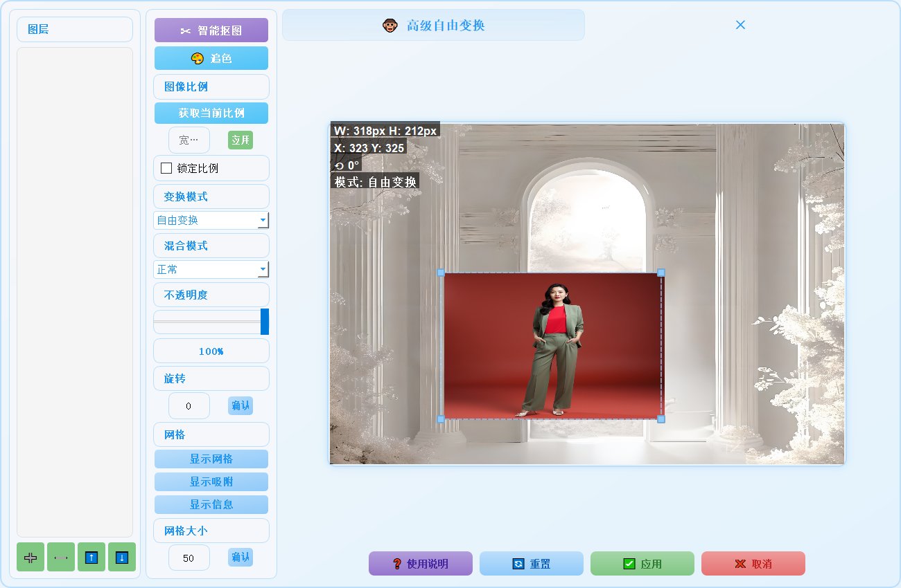
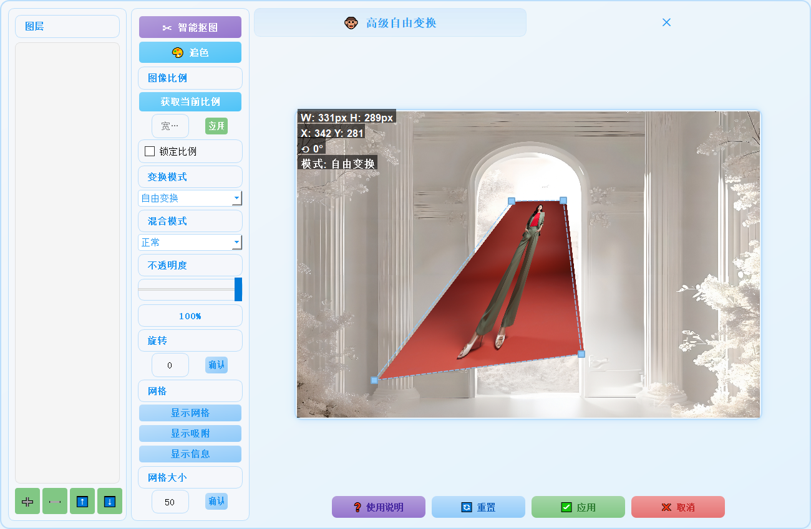
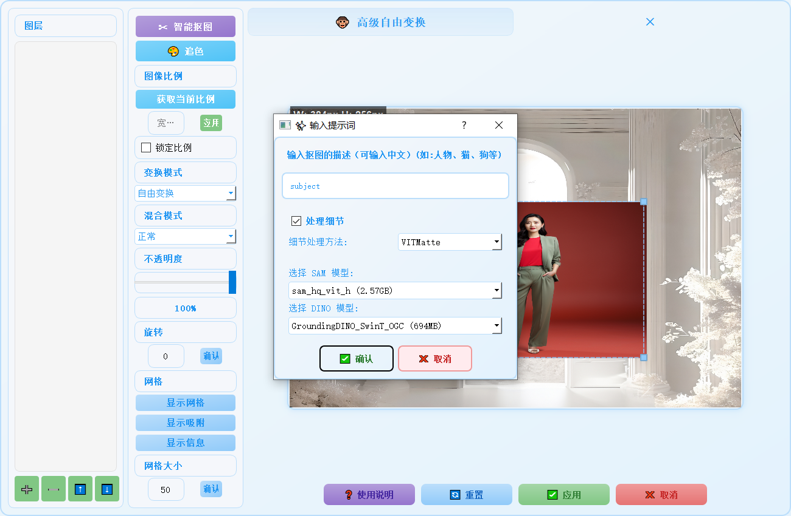
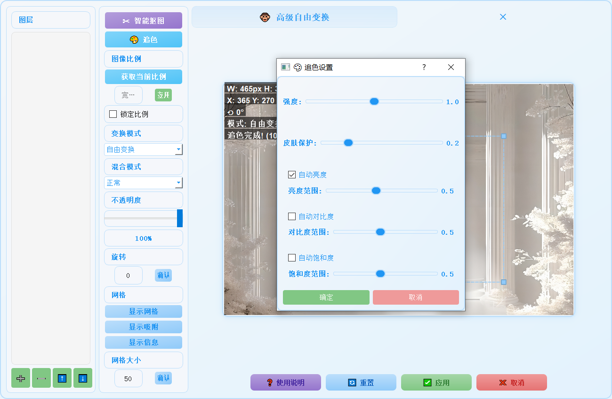
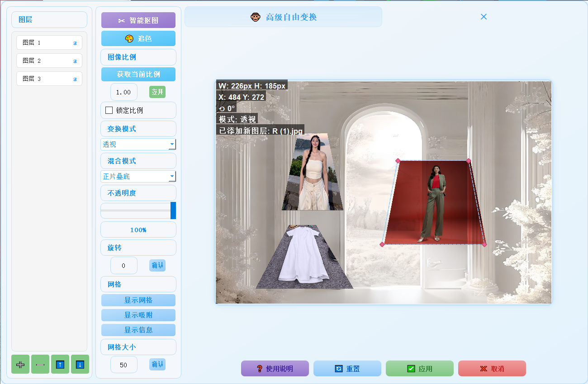
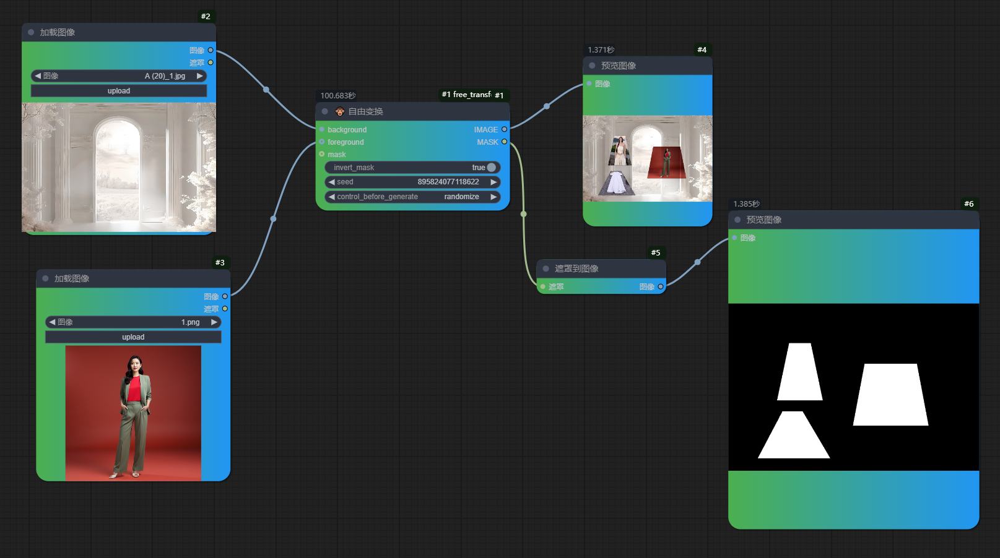

# 🐵 高级自由变换插件

一个功能强大的 ComfyUI 图像变换插件,支持多图层、智能抠图、追色等高级功能。

## ✨ 主要特性

### 基础变换功能
- 自由变换:拖动四角控制点调整大小和形状
- 透视变换:通过控制点调整透视效果
- 旋转:支持精确角度输入和快捷旋转
- 缩放:使用鼠标滚轮进行缩放
- 移动:直接拖动图层进行位置调整
- 翻转:支持水平和垂直翻转

### 图层管理
- 多图层支持:可添加、删除、重排图层
- 图层可见性控制
- 混合模式:支持14种专业混合模式
- 不透明度调节
- 图层重命名

### 智能功能
- 智能抠图:使用文字描述自动抠除目标对象
- 支持多种抠图模型:
  - SAM Ultra
  - SAM HQ
  - SAM-B + DINO
- 追色功能:自动匹配背景图片的颜色风格
- 细节优化:支持多种细节处理方法
  - VITMatte
  - VITMatte(local)
  - PyMatting
  - GuidedFilter

### 辅助功能
- 网格显示:开启网格辅助对齐
- 吸附功能:自动吸附到网格线
- 比例锁定:保持图像宽高比
- 实时信息显示:
  - 尺寸信息
  - 坐标信息
  - 旋转角度
  - 当前模式
  - 操作进度

## 🚀 使用方法

### 基本操作
1. 拖拽图层
   - 直接将图片文件拖入窗口创建新图层
   - 在图层列表中拖动调整图层顺序

2. 图层管理
   - 点击左侧图层列表切换当前图层
   - 点击眼睛图标控制图层显示/隐藏
   - 双击图层名称进行重命名

3. 变换操作
   - 拖动四角控制点调整大小和形状
   - 右键菜单访问更多变换选项
   - 使用鼠标滚轮缩放
   - 直接拖动移动图层

### 高级功能

1. 智能抠图
   ```
   1. 选择目标图层
   2. 点击"智能抠图"按钮
   3. 输入目标对象描述(支持中文)
   4. 选择抠图模型和细节处理方法
   5. 确认开始处理
   ```

2. 追色功能
   ```
   1. 选择需要调整的图层
   2. 点击"追色"按钮
   3. 在设置面板中调整参数:
      - 强度
      - 皮肤保护
      - 亮度
      - 对比度
      - 饱和度
   4. 确认应用效果
   ```

3. 比例控制
   ```
   1. 点击"获取当前比例"
   2. 输入目标比例
   3. 勾选"锁定比例"保持变换时的比例
   ```

## 🛠️ 安装方法

1. 下载插件文件
2. 将文件夹放入 ComfyUI 的 `custom_nodes` 目录
3. 重启 ComfyUI
4. 在节点列表中找到 "🐵 自由变换" 节点

## 📝 注意事项

- 首次使用需要进行授权验证
- 禁止商业用途,需要商用请联系作者
- 建议在处理大图片时先调整预览尺寸
- 使用智能抠图功能时需要联网下载模型
- 追色功能处理时间与图片尺寸相关
- 插件内置加密验证节点,因为维护和开发需要耗费大量的精力和时间,防止他人盗用源码后改名发布

## 🔗 联系方式

- 微信: xiutuxiaoliu
- 抖音: 悟空（AI摄影）、大师兄（AIGC）

## 📄 许可证

本插件仅供个人使用,禁止商业用途。如需商用请联系作者获取授权。


## 📸 功能展示

### 主界面


### 基础变换


### 智能抠图


### 追色效果


### 多图层操作
 

### 其他展示

